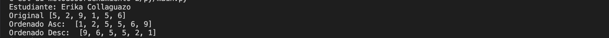
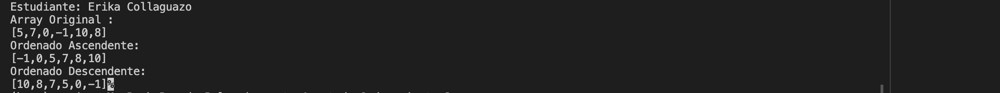

## Estrucrtura de datos

**Estudiante:** Erika Collaguazo

## Metodos Ordenamiento

### Practica 1 - 20/OCT
Metodo Sort Bubble

### Praxtica 2 - 21/OCT
Metodo Sort Seleccion en Java y Python

salida de python

Salida de Java

