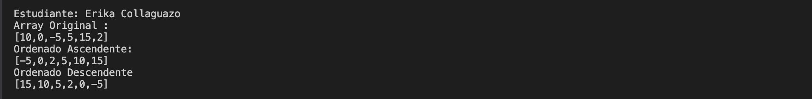
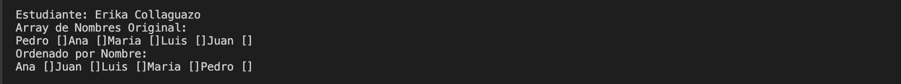
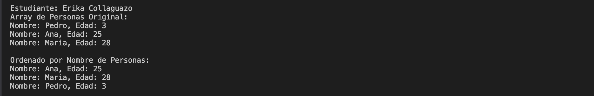
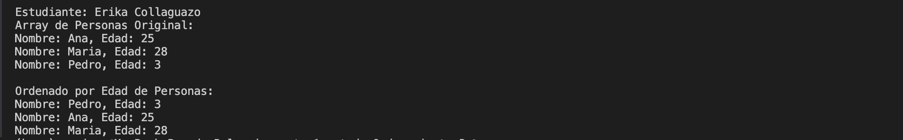

## Estrucrtura de datos

**Estudiante:** Erika Collaguazo

## Metodos Ordenamiento

# Practica 1 - 20/OCT
Metodo Sort Bubble

# Practica 2 - 21/OCT
Metodo Sort Seleccion en Java y Python

salida de python

Salida de Java

# Practica 3 - 23/OCT
Metodo Insertion Sort en java. 

Implementaciones en distintos tipos de arreglos 

## Salidas esperadas

### 1. Arreglo de números enteros

### 2. Arreglo de cadenas (nombres)

### 3. Arreglo de personas ordenado por nombre

### 4. Arreglo de personas ordenado por edad

